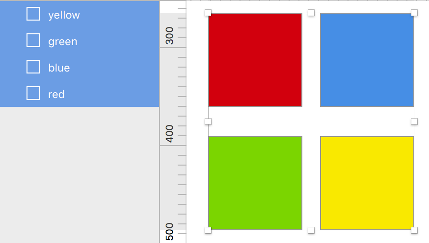

# Sketch Color Variables

A Sketch plugin that will export the fill color of selected layers to SCSS, LESS and CSS files. **Note**: this plugin is designed to work with solid color fills, gradient fills will not be exported.

1. Name the layers your preferred variable names.
1. Select the layers containing the colors you want exported.
1. Run the plugin via the Plugins menu, or via the keyboard shortcut <kbd>shift</kbd> + <kbd>cmd</kbd> + <kbd>,</kbd>

Three files will be exported to your `~/Desktop/`

- _color.scss
- _color.less
- _color.css

## Installation

Copy the entire `Sketch-Color-Vars` folder to your _Plugins_ directory.

## Example



```scss
// _color.scss
$red: rgba(82%,1%,11%,1.00);
$blue: rgba(29%,56%,89%,1.00);
$green: rgba(49%,83%,13%,1.00);
$yellow: rgba(97%,91%,11%,1.00);
```

```less
// _color.less
@red: rgba(82%,1%,11%,1.00);
@blue: rgba(29%,56%,89%,1.00);
@green: rgba(49%,83%,13%,1.00);
@yellow: rgba(97%,91%,11%,1.00);
```

```css
/* _color.css */
:root {
  --red: rgba(82%,1%,11%,1.00);
  --blue: rgba(29%,56%,89%,1.00);
  --green: rgba(49%,83%,13%,1.00);
  --yellow: rgba(97%,91%,11%,1.00);
}
```
